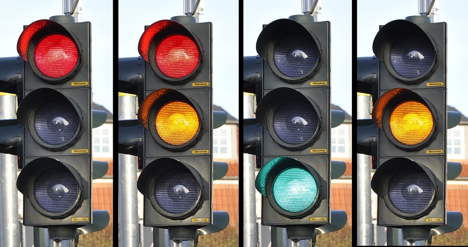

## Zadanie 1

W zadaniu znajduje się komponent `UpperCaseText` służący do zmiany liter na wielkie.

Jest on napisany w sposób funkcyjny. Przepisz go na działającą klasę ES6.

## Zadanie 2

Stwórz komponent `AnotherColor`, który przechowuje kolor do wyświetlenia jako **stan lokalny**. Niech kolor będzie domyślnie nastawiony na "yellow".

Komponent ma wyrenderować ten element `div` z tłem ustawionym na to ze stanu lokalnego.

Dodaj do swojego komponentu timer, który po 5 sekundach zmieni ten kolor na "blue". **Pamiętaj aby zrobić to w odpowiedniej metodzie cyklu życia, pamiętaj aby zwolnić zasoby.**

## Zadanie 3

Stwórz komponent o nazwie `TrafficLights`. Przechowuje on w stanie lokalnym numer światła do wyświetlenia od 1 do 4. Domyślnie jest to 1. Do `props` przyjmuje wartości:

- `redTime` (długość, z jaką ma się wyświetlać pierwsze światło - czerwone - w sekundach);

- `yellowTime` (długość, z jaką ma się wyświetlać drugie i czwarte światło - czerwone/żółte oraz samo żółte - w sekundach);

- `greenTime` (długość, z jaką ma się wyświetlać trzecie światło - zielone - w sekundach).

Komponent powinien wyświetlać w elemencie `div` trzy kolejne `div`-y z wysokością i szerokością ustawioną na 100px i `border-radius` ustawionym na 50%. W zależności od tego, które światło powinno świecić, każdy z trzech wewnętrznych elementów `div` ma tło albo czarne (wyłączone) albo o odpowiednim kolorze (włączone, poniżej kolory).

Światła powinny działać w następujący sposób i w takiej kolejności:

Dodaj odpowiednie timery / interval do swojego komponentu, który po liczbie sekund określonej w props zmieni odpowiednie światło zgodnie z kolejnością. **Pamiętaj aby zrobić to w odpowiedniej metodzie cyklu życia, pamiętaj aby zwolnić zasoby.**

