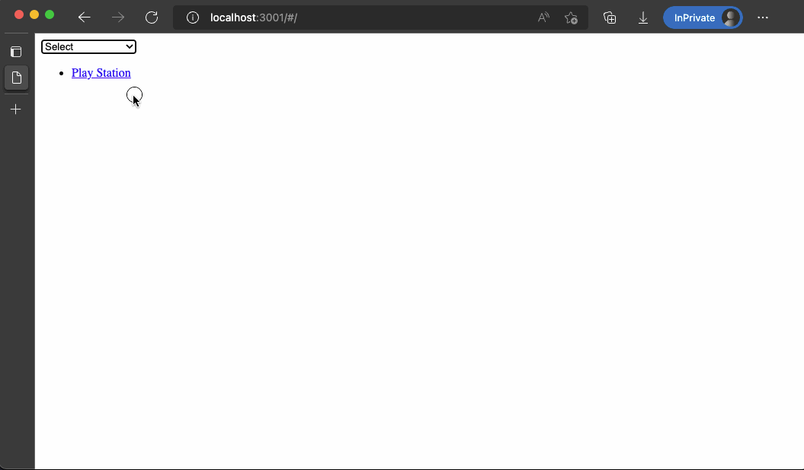

## Zadanie 1

Stwórz komponent o nazwie `PESELInput`.

Ma on wyświetlać w elemencie `form` elementy `input` oraz drugi `div`.

`input` ma być kontrolowanym elementem formularza. Podczas wpisywania sprawdzaj czy wpisany tekst ma 11 znaków i czy są to same cyfry:

- Jeżeli tak, to w wewnętrznym elemencie `div` wyświetl `input type="submit"` z napisem "Prześlij" (póki co nie ma nic robić);

- Jeżeli nie, to w wewnętrznym elemencie `div` wyświetl informację "Niepoprawny numer PESEL".


## Zadanie 2

Stwórz komponent `AdultStuff` oraz `AdultStuffBox`.

Komponent `AdultStuff` renderuje w elemencie `form` element `input type="number"`, który jest kontrolowanym elementem formularza, a użytkownik podaje w nim swój wiek.

Renderuje również komponent `AdultStuffBox`, przekazując mu przez `props` atrybut `age`, który jest aktualnym wiekiem wpisanym w `input`.

Komponent `AdultStuffBox` wyświetla "Lorem ipsum, treść dla pełnoletnich.". Jeżeli natomiast okaże się, że wartość przekazana w `props` jako `age` jest mniejsza niż 18, to blokuje swoje wyświetlanie.


## Zadanie 3

Stwórz komponent `DynamicLego`, który renderuje w elemencie `form` element `input type="number"`, który jest kontrolowanym elementem formularza, a użytkownik podaje w nim ilość klocków do wyświetlania.

Renderuje również element `ul`. W elemencie `ul` ma się znajdować dokładnie tyle elementów `li`, ile aktualnie podał użytkownik w `input`. **Pamiętaj o wybraniu odpowiedniego klucza.**

Każdy element `li` ma mieć następujący styl:

- Kolor tła: czerwony,

- Wysokość: 50px,

- Szerokość: numer elementu * 50px (przykładowo, pierwszy klocek będzie miał 50px, drugi 100px, trzeci 150px itd).

Wyrenderuj i przetestuj swój komponent. Zauważ, jak zachowują się aktualizacje, kiedy zmieniasz liczbę elementów - czy działa to prawidłowo (nie ma niepotrzebnych aktualizacji)?


## Zadanie 4

Stwórz komponent `Notes`. Ma on renderować w elemencie `form` elementy `textarea`, `button` oraz `span`.

`textarea` ma być kontrolowanym elementem formularza. Ma wyświetlać to, co wpisuje użytkownik. Dodatkowo, treść wpisana przez użytkownika pokazuje się również w elemencie `span`.

Kliknięcie na `button` ma wyczyścić wpisywany tekst.


## Zadanie 5

Stwórz komponent `WhoIsPresent`. Ma on renderować w elemencie `form` elementy `select` oraz listę `ul`.

`ul` ma być na początku pusty.

`select` ma zawierać do wyboru pozycje z tej tablicy:

```js
[
  {
    value: "play-station",
    label: "Play Station",
  },
  {
    value: "macbook-pro-m1",
    label: "MacBook Pro M1",
  },
  {
    value: "new-balance",
    label: "New Balance",
  },
];
```

Po wybraniu dowolnego elementu z `select` zostaje on przeniesiony do listy `ul`, tzn. pojawia się jako `li` w `ul`, natomiast przestaje być widoczny w elemencie `select`.

Dodatkowo ma on być wyświetlany jako **link** do podstrony `/details/:value` gdzie jako `:value` należy podstawić wartość klucza `value` z wybranego obiektu. Należy zatem stworzyć komponent `Details` a także skonfigurować Routing aplikacji tak aby ścieżka ta (`Route`) była przygotowana na odbiór `:value`.

### Przykład




## Zadanie 6

Stwórz komponent `Register`. Komponent ma składać się z formularza `form`, przycisku `Zapisz` i szeregu pól:

Dane osobowe

- Imię i Nazwisko `input[text]` (min. 5 znaków)

- Email `input[email]` (min. 3 znaki i znak `@`)

- Hasło `input[password]` (min. 4 znaki)

- Powtórz hasło `input[password]` (min. 4 znaki, takie samo jak pierwsze hasło)

- Płeć `select`

Dane do wysyłki

- Adres `input[text]` (min. 3 znaki)

- Kod pocztowy `input[text]` (5 znaków (bez myślnika - wtedy same cyfry) lub 6 znaków z myślnikiem jako trzecim znakiem)

- Miasto `input[text]` (min. 2 znaki)

Każde z tych pól należy zwalidować po kliknięciu Wyślij zgodnie z regułami, które są podane.

Jeżeli nie ma błędów, należy wyświetlić podsumowanie wszystkich danych pod lub obok formularza.

Jeżeli pojawiły się błędy, należy je wyświetlić użytkownikowi na ekranie (nie w konsoli) i nie renderować podsumowania.

